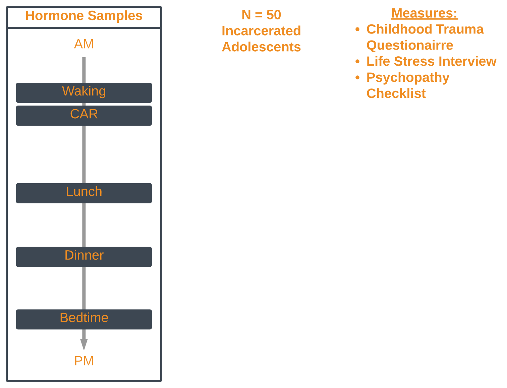
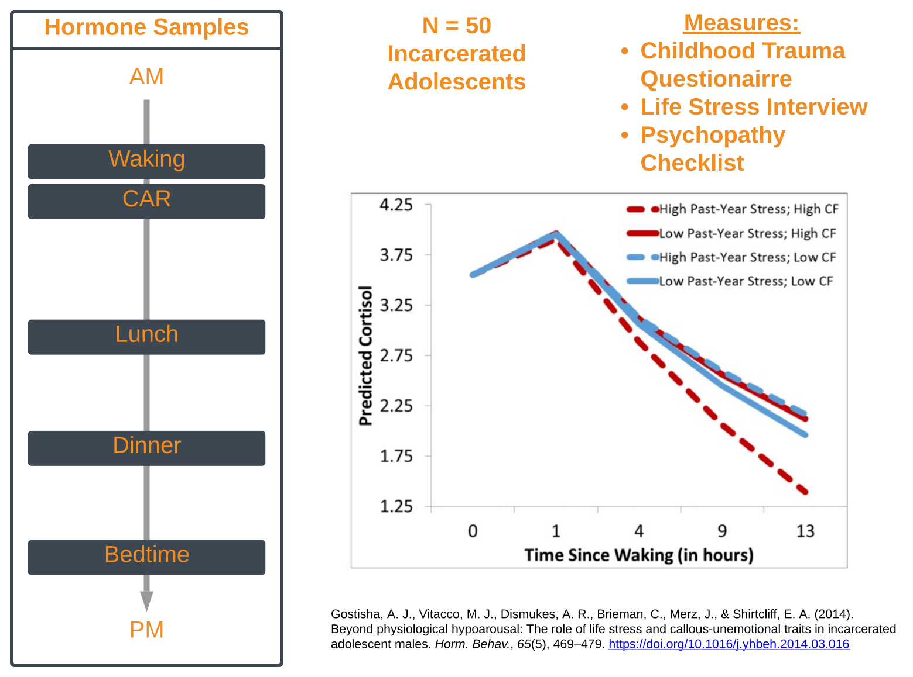

```{r setup, include=FALSE}
options(htmltools.dir.version = FALSE)
```

<!---------Introduction to topic-------->
---
class: center
# Background & Introduction
## Theme:
"Research on *life history strategy* and the evolutionary importance of *unpredictable and adverse early environments* on *development*."

.bottom[
```{r echo = FALSE, out.width = "600px"}
knitr::include_graphics("images/Figure1.png")
```
]

???
## Introduction
- Thank you for the opportunity to be here today. 
- Thank organizers
- Post-doc at PSU in GxE lab
- Did graduate work with Birdie Shirtcliff and Stacy Drury
- Much of this is indebted to Birdie
- Theme is "Research on *life history strategy* and the evolutionary importance of *unpredictable and adverse early environments* on *development*."
- Some Notes:
  - Talking about a particular research theme that has run through my training *skip*  
  - Using SRS to represent Life History Theory

<!-------------------------------->

<!---------intro to theory-------->
---
class: center
# Background & Introduction
## Theoretical Approach

.center[
```{r echo = FALSE, out.width = "70%"}

```
]
.left[
  .font60[
Del Giudice, M., Ellis, B. J., & Shirtcliff, E. A. (2011). The Adaptive Calibration Model of stress responsivity. Neurosci. Biobehav. Rev., 35(7), 1562–1592. https://doi.org/10.1016/j.neubiorev.2010.11.007
]
  ]
???
## Introduce SRS integration figure
 - Many of you will be familiar with this figure, from Del Giu, Ellis & Shirtcliff 
 - use this as framework for interpreting some results
 - The Stress response System as an *Engine* for adaptive calibration
 - The SRS organizes and adapts to context
 - There are a couple of important things to focus on here,from this broad vantage point
--
.font80[
*"The central concept of the ACM is that information encoded by the SRS in the course of development feeds back on the long-term calibration of the system itself, resulting in adaptive patterns of responsivity and individual differences in life history-related behavior."*
]

<!------------------------------->

<!---------zoom on theory-------->
---
class: center
# Background & Introduction
## Theoretical Approach
.middle[
```{r echo = FALSE, out.width = "100%"}
knitr::include_graphics("images/ACM_SRS_highlight.svg")
```
]
???
Worth Taking a Moment to focus on the SRS and define our terms
<!-------------------------------->

<!---------overview of SRS-------->
---
class: center
# Background & Introduction
## Components of the Stress Response System
```{r echo = FALSE, out.width = "70%"}

```  


 
<!----------------------------->

<!---------focus on HPA-------->
---
class: center
# Background & Introduction
## SRS: The HPA Axis
```{r echo = FALSE, out.width = "70%"}
knitr::include_graphics("images/HPA.svg")
```
???
As many of you know, The HPA axis is a biochemical cascade blah, blah, blah...
<!----------------------------------->

<!---------reminder of theory-------->
---
class: center
# Background & Introduction
## Theoretical Approach
```{r echo = FALSE, out.width = "100%"}

```
???
 - When it comes to neuroendocrine markers, the HPA is not the extent of the story
 - recent work highlights the role of sex steroids
 - these have come to play a more and more prominent role and so I wil highlight sex steroid contributions
<!-------------------------------------->

<!---------focus on sex hormones-------->
---
class: center
# Background & Introduction
## SRS: Beyond The HPA Axis
```{r echo = FALSE, out.width = "90%"}

```
???
- For the purposes of this talk I will consider HPG as a "tunable"" compoenet of the engine that is adaptive calibration
- present some data to justify this choice later
- builds from the way sex steriods are considered in ACM
<!--------------------------------------------------->

<!---------sex and stress hormone interaction-------->
---
class: center, bottom
# Background & Introduction
## SRS: Beyond The HPA Axis

```{r echo = FALSE, out.width = "700px"}

```
??? 
 - Worth considering these axes in parallel
 - describe cort
  - primarily secreted by adrena cortex
 -testo
  - primarily secreted by gonads and ovaries
 -dhea
  - product of both
  - prohormone
  exists as DHEA-s
<!----------------------------------->

<!---------SRS Adaptation 1-------->
---
class: center
# Background & Introduction
## SRS Adaptation
.bottom[
```{r echo = FALSE, out.width = "700px"}

```
]
???
 - I've been defining the SRS in terms of these measurable quantities
 - at the level of analysis of the biomarker
 - from the info I have available this IS the SRS *skip*
<!----------------------------------->

<!---------SRS Adaptation 2-------->
---
class: center
# Background & Introduction
## SRS Adaptation
```{r echo = FALSE, out.width = "700px"}

```

???
 - But, all models are lies, some are just more useful
 - We know this thing which I have drawn in neat boxes is highly malleable and messy
<!----------------------------------->

<!---------SRS Adaptation 3-------->
---
class: center
# Background & Introduction
## SRS Adaptation
```{r echo = FALSE, out.width = "700px"}

```
???
 - Good to dwell a minute on the mess
 - So much of what I am talking about is the interaction of genetics and environment
 
<!----------------------------------->

<!---------SRS Adaptation 4-------->
---
class: center
# Background & Introduction
## SRS Adaptation
```{r echo = FALSE, out.width = "700px"}

```
???
 - On a molecular genetics level this is hugely complicated, at it's simplest we are considering
 - Even within epigenetics a huge mess
    - what is epigenetics?
<!----------------------------------->

<!---------SRS Adaptation 5-------->
---
class: center
# Background & Introduction
## SRS Adaptation
```{r echo = FALSE, out.width = "700px"}

```

??? 
 - these levers operate ynergistically with multiple components of the environment
 - so this is wrong, but at least it is symettrically wrong and conveys the point of *skip*
<!----------------------------------->

<!---------SRS Adaptation 6-------->
---
class: center
# Background & Introduction
## SRS Adaptation
```{r echo = FALSE, out.width = "700px"}

```
??? 
 - Neighborhoods to nucleotides, or something like that. 
 - adaptive calibration has important levers, information is integrated across multiple levels
 - is not static but developmentally mediated
<!----------------------------------->


<!---------consider behavior-------->
---
class: center, middle
# Background & Introduction
## SRS: Profiles
```{r echo = FALSE, out.width = "700px"}

```
<!----------------------------------->

<!---------Transition to Data-------->
---
class: inverse, center, middle
# Empirical Support
<!-------------------------------------------->

<!---------Investigation Overview base-------->
---
class: center
# Empirical Support
## Overview
```{r echo = FALSE, out.width = "80%"}

```
<!---------------------------------------------->

<!---------Investigation Overview medium-------->
---
class: center
# Empirical Support
## Overview
```{r echo = FALSE, out.width = "70%"}

```
<!-------------------------------------------->

<!---------Investigation Overview full-------->
---
class: center
# Empirical Support
## Overview
```{r echo = FALSE, out.width = "70%"}

```
<!-------------------------------------------->

<!---------Investigation Overview HPA-------->
---
class: center
# Empirical Support
## Overview
.middle[
```{r echo = FALSE, out.width = "70%"}

```
]
<!-------------------------------------------->

<!------Investigation Overview Gostisha------->
---
class: center
# Empirical Support
## Overview
```{r echo = FALSE, out.width = "70%"}

```
<!------------------------------>

<!---------MJTC Overview-------->
---
class: center
# Empirical Support
## Mendota Juvenile Treatment Center
```{r echo = FALSE, out.width = "80%"}

```
<!-------------------------------->

<!---------MJTC Gostisha 1-------->
---
class: center
# Empirical Support
## Mendota Juvenile Treatment Center
```{r echo = FALSE, out.width = "80%"}

```
<!-------------------------------->

<!---------MJTC Gostisha 2-------->
---
class: center
# Empirical Support
## Mendota Juvenile Treatment Center
```{r echo = FALSE, out.width = "80%"}

```
<!--------------------------------------->

<!---------MJTC Gostisha Discussion-------->
---
class: center
# Empirical Support
## Mendota Juvenile Treatment Center
.left[
### Discussion
 - We found low waking cortisol in boys with high CU traits and an abuse history
 - boys with higher CU traits as well as boys with greater life stress exposure had flat diurnal rhythms
 - boys elevated on both CU traits and life stress exposure consistently displayed the steepest diurnal rhythms
 - *incarcerated adolescent boys with greater life stress or CU traits had similar functioning of the HPA axis, and boys elevated on both prior stress and CU traits had a unique HPA profile.*
 ]
<!-------------------------------->

<!------Investigation Overview IDS------->
---
class: center
# Empirical Support
## Overview
```{r echo = FALSE, out.width = "70%"}

```

<!------------------------------>

<!------Introduce IDS------->
---
class: center
# Empirical Support
## Overview
```{r echo = FALSE, out.width = "70%"}

```
<!------------------------------>

<!---------IDS Findings 1-------->
---
class: center
# Empirical Support
## Infant Development Study

```{r include=FALSE, message=FALSE, warning=FALSE}
library(tidyverse)
library(psych)
library(reshape2)
library(ggplot2)
library(wesanderson)
library(ggthemes)
x1<-read_csv("/home/andrewdismukes/SpiderOak Hive/Analysis/Analysis_IDS_2016_Longitudinal_Cortisol_Race/IDS_Longitudinal_Cortisol_Analyses/Databases_IDS/IDSLongitudinal/IDS_Cortisol_3_15_17.csv")

#rename the cort variables                                       
x1$Cort1<-x1$cortisol_conc1_4
x1$Cort2<-x1$cortisol_conc2_4
x1$Cort3<-x1$cortisol_conc3_4
x1$Cort4<-x1$cortisol_conc1_12
x1$Cort5<-x1$cortisol_conc3_12
x1$Cort6<-x1$cortisol_conc3_12_1

DF.Cort<-x1[, c("subject", "Cort1", "Cort2", "Cort3", "Cort4", "Cort5", "Cort6")]
rm(x1)
#get rid of drastic outliers and 999's
DF.Cort$Cort1[DF.Cort$Cort1>=10]<-NA      
DF.Cort$Cort2[DF.Cort$Cort2>=10]<-NA 
DF.Cort$Cort3[DF.Cort$Cort3>=10]<-NA
DF.Cort$Cort4[DF.Cort$Cort4>=10]<-NA
DF.Cort$Cort5[DF.Cort$Cort5>=10]<-NA
DF.Cort$Cort6[DF.Cort$Cort6>=10]<-NA

#move any value at 0 up slightly so it returns a meaningful log
DF.Cort$Cort1[DF.Cort$Cort1<=0.01]<-0.01
DF.Cort$Cort2[DF.Cort$Cort2<=0.01]<-0.01
DF.Cort$Cort3[DF.Cort$Cort3<=0.01]<-0.01
DF.Cort$Cort4[DF.Cort$Cort4<=0.01]<-0.01
DF.Cort$Cort5[DF.Cort$Cort5<=0.01]<-0.01
DF.Cort$Cort6[DF.Cort$Cort6<=0.01]<-0.01

#pull the outliers in
m1<-mean(DF.Cort$Cort1, na.rm=TRUE) + 3*sd(DF.Cort$Cort1, na.rm=TRUE)
DF.Cort$Cort1[DF.Cort$Cort1>m1]<-m1
m2<-mean(DF.Cort$Cort2, na.rm=TRUE) + 3*sd(DF.Cort$Cort2, na.rm=TRUE)
DF.Cort$Cort2[DF.Cort$Cort2>m2]<-m2
m3<-mean(DF.Cort$Cort3, na.rm=TRUE) + 3*sd(DF.Cort$Cort3, na.rm=TRUE)
DF.Cort$Cort3[DF.Cort$Cort3>m3]<-m3
m4<-mean(DF.Cort$Cort4, na.rm=TRUE) + 3*sd(DF.Cort$Cort4, na.rm=TRUE)
DF.Cort$Cort4[DF.Cort$Cort4>m4]<-m4
m5<-mean(DF.Cort$Cort5, na.rm=TRUE) + 3*sd(DF.Cort$Cort5, na.rm=TRUE)
DF.Cort$Cort5[DF.Cort$Cort5>m5]<-m5
m6<-mean(DF.Cort$Cort6, na.rm=TRUE) + 3*sd(DF.Cort$Cort6, na.rm=TRUE)
DF.Cort$Cort6[DF.Cort$Cort6>m6]<-m6

#set length
DF.Cort$Cort1<-round(DF.Cort$Cort1, digits=5)
DF.Cort$Cort2<-round(DF.Cort$Cort2, digits=5)
DF.Cort$Cort3<-round(DF.Cort$Cort3, digits=5)
DF.Cort$Cort4<-round(DF.Cort$Cort4, digits=5)
DF.Cort$Cort5<-round(DF.Cort$Cort5, digits=5)
DF.Cort$Cort6<-round(DF.Cort$Cort6, digits=5)

#Create log transformed Variables
DF.Cort$LnCort1<-log(DF.Cort$Cort1)+5
DF.Cort$LnCort2<-log(DF.Cort$Cort2)+5
DF.Cort$LnCort3<-log(DF.Cort$Cort3)+5
DF.Cort$LnCort4<-log(DF.Cort$Cort4)+5
DF.Cort$LnCort5<-log(DF.Cort$Cort5)+5
DF.Cort$LnCort6<-log(DF.Cort$Cort6)+5

#subset into clean cortisol dtabase
Df.cort<-select(DF.Cort, subject, LnCort1:LnCort6)

#Convert to long form
DF.cort.DF<-as.data.frame(Df.cort)
mdata<-melt(DF.cort.DF, id=c("subject"))
mdata$Cortisol<-mdata$value
mdata$value<-NULL
S<-mdata
S[,2] <- ifelse(S[,2] == "LnCort1", 1, ifelse(S[,2] == "LnCort2", 2, ifelse(S[,2] == "LnCort3", 3, ifelse(S[,2] == "LnCort4", 4, ifelse(S[,2] == "LnCort5", 5, ifelse(S[,2] == "LnCort6", 6, 99))))))
S$Time<-S$variable
S$variable<-NULL
S$Condition[S$Time<4]<-'SF'
S$Condition[S$Time>3]<-'SSP'
Final <- S
Final$Time[Final$Time==4] <- 1
Final$Time[Final$Time==5] <- 2
Final$Time[Final$Time==6] <- 3
Final<-as_tibble(Final)
rm(DF.Cort)
rm(DF.cort)
rm(S)
rm(mdata)
#Bring in level 2
ULSS<-read_csv("/home/andrewdismukes/SpiderOak Hive/Analysis/Analysis_IDS_2016_Longitudinal_Cortisol_Race/IDS_Longitudinal_Cortisol_Analyses/Databases_IDS/IDSLongitudinal/IDSULSS.csv")
L2<-read_csv("/home/andrewdismukes/SpiderOak Hive/Analysis/Analysis_IDS_2016_Longitudinal_Cortisol_Race/IDS_Longitudinal_Cortisol_Analyses/Databases_IDS/IDSLongitudinal//IDS_Covariates_6_7_17.csv")
x2<-merge(ULSS, L2, 'subject')
rm(ULSS)
rm(L2)
#Merge
Long_full<-merge(Final, x2, 'subject')
Wide_full<- merge(x2, DF.cort.DF, "subject")
rm(Final)
rm(DF.cort.DF)
#
xxx1<-as_tibble(Long_full)
xxx1$DEMOGRAPHICS<-factor(xxx1$raceses, levels=c(1:4), labels=c("White High SES", "Black High SES", "White Low SES", "Black Low SES"))
xxx1$SES<-as.factor(xxx1$crudeSESindex)
xxx1$HIGHSES<-factor(xxx1$highses, levels=c(0:1), labels=c('NO', 'YES'))
xxx1$c_Time<-xxx1$Time-2
xxx1$c_Time_sq<-xxx1$c_Time*xxx1$c_Time
xxx1$TIME <- xxx1$c_Time
xxx1$TIME_SQUARED<- xxx1$c_Time_sq
xxx1$SEX <- xxx1$baby_sex
xxx1$AGE <- scale(xxx1$gest_age, center=TRUE, scale=FALSE)
xxx1$RACE <- xxx1$momrace
xxx1$RACE_CAT<-as.factor(xxx1$RACE)
xxx1$HIGH_SES<-as.numeric(xxx1$highses)
xxx1$SEX<-xxx1$SEX-1
xxx1$SESnumber<-as.numeric(xxx1$SES)
xxx1$SESnumber <- scale(xxx1$SESnumber, center=TRUE, scale=FALSE)
LongFile<-Long_full
LongFile$c_Time<-LongFile$Time-1
LongFile$c_Time_sq<-LongFile$c_Time*LongFile$c_Time
LongFile$TIME <- LongFile$c_Time
LongFile$TIME_SQUARED<- LongFile$c_Time_sq
LongFile$SEX <- LongFile$baby_sex
LongFile$AGE <- LongFile$gest_age
LongFile$RACE <- LongFile$momrace
LongFile$React<-LongFile$Time
LongFile$React[LongFile$React==1]<--1
LongFile$React[LongFile$React==2]<-0
LongFile$React[LongFile$React==3]<-0
LongFile$Recover<-LongFile$Time
LongFile$Recover[LongFile$Recover==1]<-0
LongFile$Recover[LongFile$Recover==2]<-0
LongFile$Recover[LongFile$Recover==3]<-1
LongFile$gest_age<-scale(LongFile$gest_age, center=TRUE, scale=FALSE)
SF<-subset(LongFile, Condition=='SF')
SSP<-subset(LongFile, Condition=='SSP')
BlackLongFile<-subset(LongFile, RACE==0)
WhiteLongFile<-subset(LongFile, RACE==1)
BlackSF<-subset(SF, RACE==0)
WhiteSF<-subset(SF, RACE==1)
BlackSSP<-subset(SSP, RACE==0)
WhiteSSP<-subset(SSP, RACE==1)
test<-na.omit(Df.cort)
test$SSP<-1
test<-test %>%
  select("subject", "SSP")
test_merge<-merge(Wide_full, test, "subject", all=TRUE)
test_merge$SSP[is.na(test_merge$SSP)] <- 0
test<-test_merge
rm(test_merge)
```

```{r figure 1, echo=FALSE, message=FALSE, warning=FALSE, out.width = "50%"}
Figure1<-xxx1 %>%
    mutate(Race=factor(momrace, levels=c(0,1), labels=c("Black", "White"))) %>%
      ggplot(aes(Time, Cortisol, color=Condition)) + 
      geom_smooth(position=position_dodge(0.25), se = F) + 
      stat_summary(fun.data = mean_cl_normal, 
                   geom = "errorbar", 
                   fun.args = list(mult = 1),  
                   position=position_dodge(0.25),
                   size = 0.5,
                   width=0.2,
                   aes(linetype = Condition)) +
      scale_color_manual(values=wes_palette(name="Moonrise2")) + 
      scale_fill_manual(values=wes_palette(name="Darjeeling2")) +
      scale_x_continuous(breaks=(1:3), labels=c("ARRIVAL + 15", "PEAK STRESS + 15", "PEAK STRESS + 45")) + 
      theme_bw() + 
      #facet_grid(. ~ Condition) + 
      ggtitle('Cortisol by Condition') +
      theme(plot.title = element_text(hjust = 0.5)) +
      theme(axis.text.x=element_text(angle=45, hjust=1)) +
      theme(plot.caption=element_text(hjust=0.5)) + 
      labs(x="Time across Stress Event", y = "Log Transformed Cortisol")
Figure1
```

.left[.font60[Dismukes, A., Shirtcliff, E., Jones, C. W., Zeanah, C., Theall, K., & Drury, S. (2018). The development of the cortisol response to dyadic stressors in Black and White infants. Development and Psychopathology, 30(5), 1995–2008. https://doi.org/10.1017/S0954579418001232
]]
<!--------------------------->

<!---------IDS Findings 2-------->
---
class: center
# Empirical Support
## Infant Development Study
```{r figure 2, echo=FALSE, message=FALSE, warning=FALSE}
xxx1 %>%
  filter(Condition=='SSP') %>%
    mutate(Race=factor(momrace, levels=c(0,1), labels=c("Black", "White"))) %>%
    filter(Race=='Black') %>%
    mutate(SES=factor(highses, levels=c(0,1), labels=c("Low SES", "High SES"))) %>%
    mutate(EOD=if_else(EODworry_sum <= mean(EODworry_sum), 'Low EOD', 'High EOD')) %>%
      ggplot(aes(Time, Cortisol)) + 
      geom_smooth(se=F, alpha=0.3, aes(color=EOD), position=position_dodge(0.25)) + 
      scale_color_manual(values=wes_palette(name="Moonrise2")) + 
      scale_fill_manual(values=wes_palette(name="Darjeeling2")) +
      scale_x_continuous(breaks=(1:3), labels=c("ARRIVAL + 15", "PEAK STRESS + 15", "PEAK STRESS + 45")) + 
      theme_bw() + 
      theme(legend.position = c(0.8, 0.5)) +  
      stat_summary(fun.data = mean_cl_normal, 
                   geom = "errorbar", 
                   fun.args = list(mult = 1),  
                   position=position_dodge(0.25),
                   size = 0.5,
                   width=0.2,
                   aes(linetype = EOD, color = EOD)) +
      theme(plot.title = element_text(hjust = 0.5)) +
      theme(axis.text.x=element_text(angle=45, hjust=1)) +
      theme(plot.caption=element_text(hjust=0.5)) +
      labs(y = "Log Transformed Cortisol", title = "EOD")
      theme(axis.title.x=element_blank()) + 
      theme(axis.title.y=element_blank())
```


<!--------------------------->

<!---------IDS Discussion-------->
---
class: center
# Empirical Support
## Infant Development Study
### Discussion
.left[
 - higher maternal report of worry related to discrimination was associated with significantly higher cortisol levels suggesting a cross-generational impact of discrimination on infant physiology.
 ]
<!-------------------------------->


<!------Investigation Overview MJTC Dismukes------->
---
class: center
# Empirical Support
## Overview
```{r echo = FALSE, out.width = "70%"}

```
<!------------------------------>

<!---------MJTC Overview-------->
---
class: center
# Empirical Support
## Mendota Juvenile Treatment Center
```{r echo = FALSE, out.width = "80%"}

```
<!-------------------------------->

<!---------MJTC Dismukes Coupling 1-------->
---
class: center
# Empirical Support
## Mendota Juvenile Treatment Center
```{r echo = FALSE, out.width = "80%"}

```

<!-------------------------------->

<!---------MJTC Dismukes Coupling 2-------->
---
class: center
# Empirical Support
## Mendota Juvenile Treatment Center
```{r echo = FALSE, out.width = "80%"}

```
<!-------------------------------->

<!---------MJTC Gostisha Discussion-------->
---
class: center
# Empirical Support
## Mendota Juvenile Treatment Center
.left[.font80[
### Discussion
- Incarceration is:
 - Stable, but stressful
 - status oriented
 - filled with competition, challenge, and violence
- *prison is a context where mechanistically it makes sense for both sex and stress hormones to be activated, jointly contributing to the best adaptive functioning of the individual for that setting.*
 
- ELA influences both the HPG and HPA
  - faster life history strategy with advanced maturation of HPG
- Johnson and colleagues found increased coupling of the HPA and HPG axes within this same population, in the context of elevated interpersonal psychopathy symptoms; the authors interpret this finding as being indicative of high social dominance and manipulative traits, with the HPG recruiting the HPA 
]]
<!-------------------------------->

<!---------MRI Intro  -------->
---
class: center
# Empirical Support
## Context for Coupling
```{r echo = FALSE, out.width = "80%"}

```
<!-------------------------------->

<!---------MRI Overview  -------->
---
class: center
# Empirical Support
## Context for Coupling
```{r echo = FALSE, out.width = "60%"}

```
<!-------------------------------->

<!---------MRI Findings  -------->
---
class: center
# Empirical Support
## Context for Coupling
```{r echo = FALSE, out.width = "90%"}

```
<!-------------------------------->


<!---------MRI Findings  -------->
---
class: center
# Empirical Support
## Discussion
.left[
 - The HPA and HPG axes were positively coupled
  - more so in an environment of **stress** and **challenge**
 - The effect of life stress exposure on the lab day was largely non-significant. 
 ]
<!-------------------------------->

<!---------MJ & SOGS Overview  -------->
---
class: center
# Mendota & SOGS
## Context for Coupling
```{r echo = FALSE, out.width = "60%"}

```
<!-------------------------------->


<!---------SOGS Baseline-------->
---
class: center
# Empirical Support
## Mendota & SOGS
.pull-left[
```{r echo = FALSE, out.width = "90%"}

```
]
<!-------------------------------->

<!---------SOGS Baseline Cort-------->
---
class: center
# Empirical Support
## Mendota & SOGS
.pull-left[
```{r echo = FALSE, out.width = "90%"}

```
]
.pull-right[
## Cortisol

```{r, include=FALSE}
library(install.load)
install_load("tidyverse", "psych", "lme4", "lmerTest", "nlme", "xtable", "foreign", "ggthemes", "wesanderson", "forcats", "reshape", "sjPlot")
setwd("~/SpiderOak Hive/Analysis/Analysis_SOGS_2016_Hormones/Analysis_SOGS/Analysis_SOGS_2016_Hormones/Main_Analysis")
JAIL_L1 <- read_csv("Databases_SOGS/Hormones_Level1.csv")
DFL<-JAIL_L1 # Shortens mname of dataset
DFL$lncort<-log(DFL$cort) + 5
DFL$lntesto<-log(DFL$testo) 
DFL$lndhea<-log(DFL$dhea) 
DFL$Sample3<-DFL$sample1
DFL$Sample3[DFL$Sample3==1]<-1
DFL$Sample3[DFL$Sample3==2]<-1.75
DFL$Sample3[DFL$Sample3==3]<-4.5
DFL$Sample3[DFL$Sample3==4]<-8
DFL$Sample3[DFL$Sample3==5]<-12
CTQ<-read_csv("Databases_SOGS/CTQSA.csv")
CTQ$PDSS.imp.mean <- ifelse(is.na(CTQ$PDSS), mean(CTQ$PDSS, na.rm=TRUE), CTQ$PDSS)
CTQ$PDSS<-CTQ$PDSS.imp.mean
CTQ$PDSS.imp.mean<-NULL
CTQ$SA<-CTQ$cctqSA
CTQ$SA[CTQ$SA>0]<-1
Jail_L2<-read_csv("Databases_SOGS/JAIL_L2.csv")
ICU<-Jail_L2[, c("ID", "ICUtot_c", "ICUcall_c", "APSD_tot_c", "APSD_cal_c")]
CTQtemp<-merge(ICU, CTQ, "ID")
CTQDF<-merge(DFL, CTQtemp, "ID")

# write.csv(CTQDF, "Long_Jail.csv")
```

```{r, echo=FALSE, message=FALSE, warning=FALSE, out.width = "90%"}
DFL %>%
  mutate(Sex = factor(Sex, levels=c(1:2), labels=c("Boys", "Girls"))) %>%
      ggplot(aes(Sample3, lncort, color=Sex)) + 
      stat_summary(fun.y = mean, 
                   geom="line", 
                   size = 2, 
                   position=position_dodge(0.25)) + 
      stat_summary(fun.data = mean_cl_normal, 
                   geom = "errorbar", 
                   fun.args = list(mult = 1),  
                   position=position_dodge(0.25),
                   size = 0.5,
                   width=0.2,
                   aes(linetype = Sex)) +  
      theme_bw() +
      scale_color_manual(values=wes_palette(name="Moonrise2")) + 
      scale_fill_manual(values=wes_palette(name="Darjeeling2")) +
      theme(
      # axis.ticks = element_blank(), 
      # axis.text.x = element_blank(), 
      # axis.title.x = element_blank()) + 
      # theme(
      #   panel.grid.major = element_blank(),
      #   panel.grid.minor = element_blank(),
      panel.background = element_blank()) + 
      scale_x_discrete(limits=c(1,1.75,4.5, 8, 12), labels = c('Waking','CAR','Lunch', 'Dinner', 'Bed')) + 
      theme(axis.text.x=element_text(angle=45, hjust=1, size = 12)) + 
      theme(axis.title.x = element_text(size = 14)) + labs(x="Time") + 
      theme(axis.title.y = element_text(size = 14)) + labs(y="Log Transformed Cortisol") + 
      theme(legend.position = c(0.8, 0.8)) + 
      theme(legend.text = element_text(size=12 
                                     ))
```
]
???
SA had a significant main effect on the diurnal slope (i.e., time since waking), indicating a greater decrease in cortisol level across the day with each unit increase in sexual abuse (B=-.003, p< .015). SA did not have a significant effect on CAR (B=-.006, p=.528), and did not have a significant main effect on waking cortisol (B=.011, p=.196). 

in order to test if sexual abuse has a unique effect on the hormones, the SA subscale was modeled alone, in the same model as the physical abuse (PA) subscale, and then in the same model as a composite CTQ score with the exception of SA (i.e., physical abuse, emotional abuse, and physical and emotional neglect subscales).  Adding the CTQ composite of four subscales to the base model did not change effects of SA on diurnal cortisol (B=-.005, p< .05) or waking cortisol (p= ns)

In sum, SA had a significant effect on the diurnal slope after controlling for gender, race, BMI, and other types of abuse. SA predicted steeper cortisol slopes, but had no significant effect on CAR and waking cortisol
<!--------------------------->

<!---------SOGS Baseline Testosterone-------->
---
class: center
# Empirical Support
## Mendota & SOGS
.pull-left[
```{r echo = FALSE, out.width = "90%"}

```
]
.pull-right[
## Testosterone
```{r, echo=FALSE, message=FALSE, warning=FALSE, out.width = "90%"}
DFL %>%
  mutate(Sex = factor(Sex, levels=c(1:2), labels=c("Boys", "Girls"))) %>%
      ggplot(aes(Sample3, lntesto, color=Sex)) + 
      stat_summary(fun.y = mean, 
                   geom="line", 
                   size = 2, 
                   position=position_dodge(0.25)) + 
      stat_summary(fun.data = mean_cl_normal, 
                   geom = "errorbar", 
                   fun.args = list(mult = 1),  
                   position=position_dodge(0.25),
                   size = 0.5,
                   width=0.2,
                   aes(linetype = Sex)) +  
      theme_bw() +
      scale_color_manual(values=wes_palette(name="Moonrise2")) + 
      scale_fill_manual(values=wes_palette(name="Darjeeling2")) +
      theme(
      # axis.ticks = element_blank(), 
      # axis.text.x = element_blank(), 
      # axis.title.x = element_blank()) + 
      # theme(
      #   panel.grid.major = element_blank(),
      #   panel.grid.minor = element_blank(),
      panel.background = element_blank()) + 
      scale_x_discrete(limits=c(1,1.75,4.5, 8, 12), labels = c('Waking','CAR','Lunch', 'Dinner', 'Bed')) + 
      theme(axis.text.x=element_text(angle=45, hjust=1, size = 12)) + 
      theme(axis.title.x = element_text(size = 14)) + labs(x="Time") + 
      theme(axis.title.y = element_text(size = 14)) + labs(y="Log Transformed Testosterone")+ 
      theme(legend.position = c(0.8, 0.8)) + 
      theme(legend.text = element_text(size=12 
                                     ))
```
]
<!--------------------------->

<!---------SOGS Baseline DHEA-------->
---
class: center
# Empirical Support
## Mendota & SOGS
.pull-left[
```{r echo = FALSE, out.width = "90%"}

```
]
.pull-right[
## DHEA
```{r, echo=FALSE, message=FALSE, warning=FALSE, out.width = "90%"}
DFL %>%
  mutate(Sex = factor(Sex, levels=c(1:2), labels=c("Boys", "Girls"))) %>%
      ggplot(aes(Sample3, lndhea, color=Sex)) + 
      stat_summary(fun.y = mean, 
                   geom="line", 
                   size = 2, 
                   position=position_dodge(0.25)) + 
      stat_summary(fun.data = mean_cl_normal, 
                   geom = "errorbar", 
                   fun.args = list(mult = 1),  
                   position=position_dodge(0.25),
                   size = 0.5,
                   width=0.2,
                   aes(linetype = Sex)) +  
      theme_bw() +
      scale_color_manual(values=wes_palette(name="Moonrise2")) + 
      scale_fill_manual(values=wes_palette(name="Darjeeling2")) +
      theme(
      # axis.ticks = element_blank(), 
      # axis.text.x = element_blank(), 
      # axis.title.x = element_blank()) + 
      # theme(
      #   panel.grid.major = element_blank(),
      #   panel.grid.minor = element_blank(),
      panel.background = element_blank()) + 
      scale_x_discrete(limits=c(1,1.75,4.5, 8, 12), labels = c('Waking','CAR','Lunch', 'Dinner', 'Bed')) + 
      theme(axis.text.x=element_text(angle=45, hjust=1, size = 12)) + 
      theme(axis.title.x = element_text(size = 14)) + labs(x="Time") + 
      theme(axis.title.y = element_text(size = 14)) + labs(y="Log Transformed DHEA") + 
      theme(legend.position = c(0.8, 0.8)) + 
      theme(legend.text = element_text(size=12 
                                     ))
```
]
<!--------------------------->
<!---------Conclusions-------->
---
# Conclusions
.pull-left[
- importance of HPG
- importance of timing 
- kind of ELA
- importance of context

]
<!---------END-------->
---

# Thanks!

Slides available at: 
.font60[
https://andrewdismukes.github.io/Presentations_2019_SRCD_EvoDevoPreconference/SRCD_Preconference_2019.html
]
.pull-left[
## Special thanks to
 - Elizabeth Shirtcliff & SPIT Lab at Iowa State
 - Stacy Drury & Behavioral and Neurodevelopmental Genetics Lab at Tulane
 - Jenae Neiderhiser and Gene Environment Interplay Lab at Penn State
]
.pull-right[
```{r echo = FALSE, out.width = "60%"}

```
```{r echo = FALSE, out.width = "60%"}

```
```{r echo = FALSE, out.width = "60%"}

```
]
Slides created via the R package [**xaringan**](https://github.com/yihui/xaringan).

